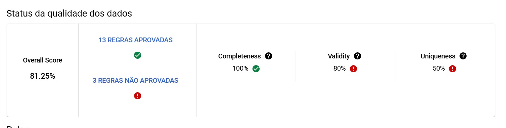
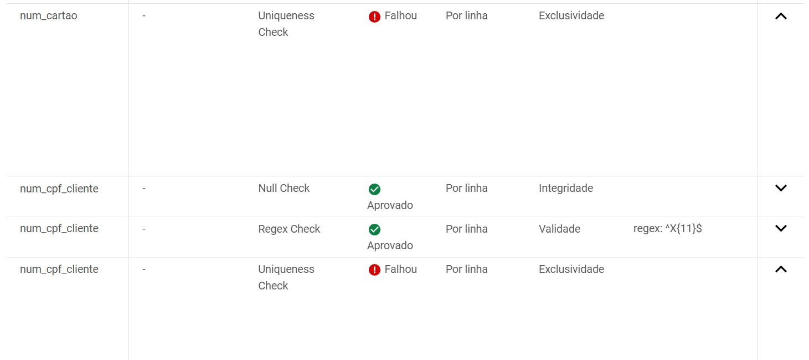

# Relatório: Validação de Dados

*Nome do Estágiario:* Millena França
*Data:* 01/11

*Conteúdos:*  
1. **[Criação de perfil de dados](#criação-de-perfil-de-dados)**
2. **[Criando regras de verificação](#criando-regras-de-verificação)**

## Resumo dos módulos 
### Análise de qualidade dos Dados

Este documento descreve a qualidade de dados automática do Dataplex, que permite definir e medir a qualidade dos seus dados. É possível automatizar a verificação de dados, validar dados em relação a regras definidas e registrar alertas se os dados não atenderem aos requisitos de qualidade. É possível gerenciar as regras de qualidade implantações como código, melhorando a integridade dos pipelines de produção de dados.

É possível exportar os resultados da verificação de criação de perfil de dados para uma tabela do BigQuery para uma análise mais detalhada

### **Criação de perfil de dados**

O perfil de dados no BigQuery e no Dataplex refere-se ao processo de análise das características dos dados de uma tabela ou dataset para entender melhor sua estrutura, distribuição e anomalias.
Os resultados de perfil incluem:

**Coluna numérica:**
- Porcentagem de valores nulos.
- Porcentagem de valores aproximados únicos (distintos).
- Os 10 valores mais comuns na coluna. Pode ser menor que 10 se o número de valores únicos na coluna for menor que 10 (valores nulos não são incluídos). Para cada um desses valores mais comuns, a porcentagem ocorrência nos dados verificados na verificação atual.
- média, desvio padrão, mínimo, quartil inferior aproximado, mediana aproximada, quartil superior aproximado e valores máximos.

**Coluna de string:**
- Porcentagem de valores nulos.
- Porcentagem de valores únicos (distintos) aproximados.
- Os 10 principais valores mais comuns na coluna, que podem ser menores que 10 se o número de valores exclusivos na coluna for menor que 10.
- Comprimento médio, mínimo e máximo da string.

**Colunas não aninhadas (data, hora, binários, etc):**
- Porcentagem de valores nulos.
- Porcentagem de valores únicos (distintos) aproximados.
- Os 10 principais valores mais comuns na coluna, que podem ser menores que 10 se o número de valores exclusivos na coluna for menor que 10.


**Principais utilidades:**
- **Identificação de valores e qualidade:** valores duplicados ou insconsistentes
- **Distribuição estátistica:** taxas de preenchimento, percentual de valores nulos, média, mediana, desvio padrão, etc
- **Detecção de anomalias:** valores que não seguem a distribuição comum dos dados, identificação de padrões e possíveis valores incorretos
- **Entendimento da estrutura:** identificação de tipos de dados em cada coluna, relações entre tabelas

### Criando regras de verificação

Utilizei regras predefinidas para realizar testes de validação na tabela mock_cartao. Escolhi algumas colunas e apliquei as seguintes regras:

- Verificação NULL
- Verificação de regex
- Verificação de exclusividade
- Verificação de valor definido

Após escolher as colunas selecionei em quais e quantas regras seriam aplicadas


Após a criação fui aplicar as especificações nas regras necessárias (regex, valor definido)

- Para a coluna ```des_sit_cartao``` adicionei os parâmetros: 'ATIVO', 'CANCELADO' e 'BLOQUEADO', que são os valores presentes na tabela
- Para a coluna ```cod_sit_cartao``` adicionei os parâmetros: 1, 2, 3 e 4, deixando propositalmente o '5', que esta presente na tabela, de fora


- Para as colunas ```num_bin```, ```num_cartao``` e ```num_cpf_cliente``` adicionei um formate de regex correspondente aos dados da tabela.


Após a criação, no Status de qualidade de dados, foram apresentados a taxa de sucesso das regras e especificação de quais não passaram

- **Overall Score:** média ponderada dos conceitos aplicados
- **Completeness:** integridade, avalia se há valores nulos
- **Validity:** avalia se os dados seguem o formato padrão
- **Uniqueness:** mede a quantidade de valores duplicados nos dados onde se espera unicidade



A regra de definição de valor na coluna ```cod_sit_cartao``` falhou pois há valores fora dos parâmetros passados (valores passados: 1,2,3,4; valor fora: 5)


A regra de exclusividade  falhou tanto na coluna ```num_cartao``` como na ```num_cpf_cliente``` devido aos dados referentes a essas colunas estarem todos como 'XXXXXXXXXXX' na tabela, deixando de serem únicos como pede a regra




Ou seja, por meio desta ferramenta é possível aplicar de forma facil regras nas tabelas, tando as predefinidas como regras personalizadas (por expressão).


