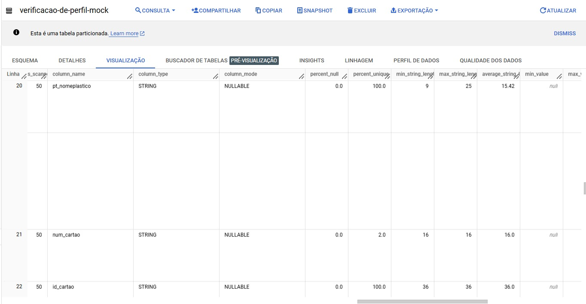
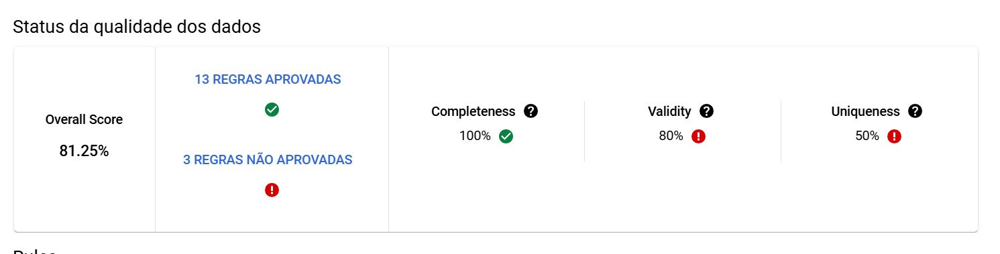
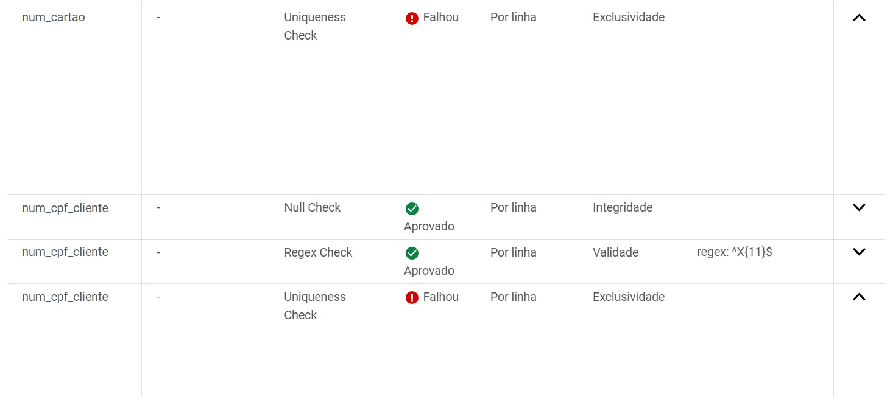

### **Perfil de dados**

Processo de análise das características dos dados de uma tabela ou dataset para entender melhor sua estrutura, distribuição e anomalias.
Os resultados de perfil incluem:

- Porcentagem de valores nulos.
- Porcentagem de valores aproximados únicos (distintos).
- Os 10 valores mais comuns na coluna.
- média, desvio padrão, mínimo, quartil inferior aproximado, mediana aproximada, quartil superior aproximado e valores máximos.

**Principais utilidades:**
- **Identificação de valores e qualidade:** valores duplicados ou insconsistentes
- **Distribuição estátistica:** taxas de preenchimento, percentual de valores nulos, média, mediana, desvio padrão, etc
- **Detecção de anomalias:** valores que não seguem a distribuição comum dos dados, identificação de padrões e possíveis valores incorretos
- **Entendimento da estrutura:** identificação de tipos de dados em cada coluna, relações entre tabelas

### **Verificação de qualidade de dados**
- Sistema automatizado, com verificações regulares e geração de relatórios de forma contínua.
- Com critérios específicos (como integridade, validade regex e exclusividade), as verificações detectam problemas específicos em cada dimensão da qualidade.
- Qualquer falha nas regras de qualidade de dados é detectada e registrada, permitindo resolver inconsistências e corrigir registros defeituosos.
- Cada verificação realizada em BigQuery tem custos associados ao processamento de dados
- é possível criar regras personalizadas (por meio de expressão sql)

Basicamente, é possível escolher quais regras serão aplicadas e em quais colunas, evitando recceber informações desnecessárias.

**Resultados da verificação**

**Regras que falharam**

